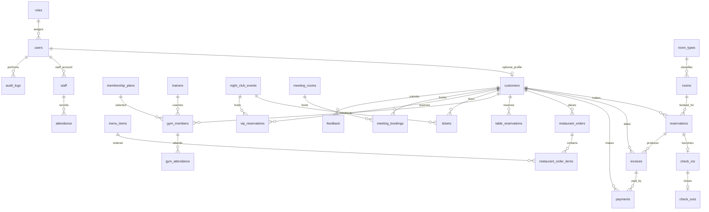

# Vora Addis Hotel Management System ER Diagram

```mermaid
erDiagram
  roles ||--o{ users : assigns
  users ||--o| customers : optional_profile
  customers ||--o{ reservations : makes
  room_types ||--o{ rooms : classifies
  rooms ||--o{ reservations : booked_for
  reservations ||--o| check_ins : becomes
  check_ins ||--o| check_outs : closes
  customers ||--o{ invoices : billed
  reservations ||--o{ invoices : produces
  invoices ||--o{ payments : paid_by
  customers ||--o{ payments : makes
  menu_items ||--o{ restaurant_order_items : ordered
  restaurant_orders ||--o{ restaurant_order_items : contains
  customers ||--o{ restaurant_orders : places
  customers ||--o{ table_reservations : reserves
  membership_plans ||--o{ gym_members : selected
  trainers ||--o{ gym_members : coaches
  customers ||--o{ gym_members : enrolls
  gym_members ||--o{ gym_attendance : attends
  night_club_events ||--o{ tickets : issues
  night_club_events ||--o{ vip_reservations : hosts
  customers ||--o{ tickets : buys
  customers ||--o{ vip_reservations : reserves
  meeting_rooms ||--o{ meeting_bookings : hosts
  customers ||--o{ meeting_bookings : books
  users ||--o{ staff : staff_account
  staff ||--o{ attendance : records
  customers ||--o{ feedback : submits
  users ||--o{ audit_logs : performs
```

